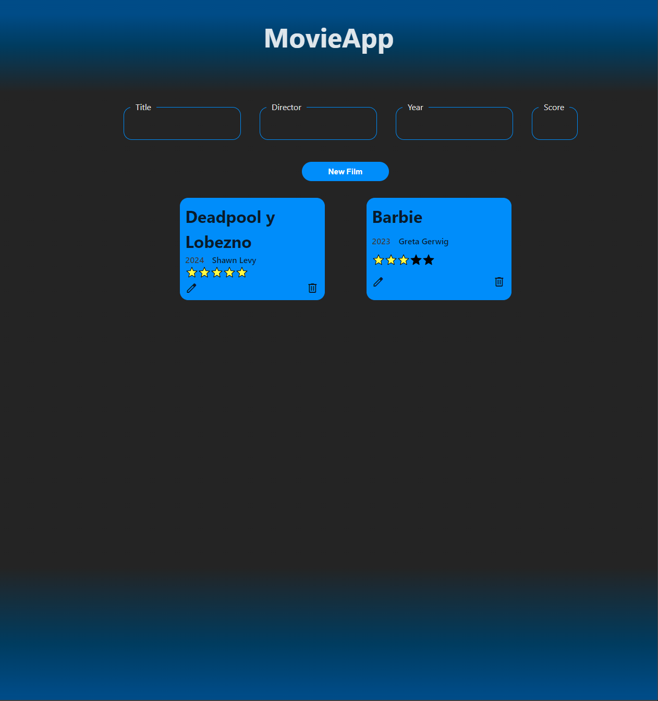

# MoviePlatform

Este proyecto está dividido en:
- FrontEnd realizado en React
- BackEnd en Python con FastAPI
- DB con MongoDB

## Despliegue
Para su puesta en funcionamiento, además clonar el repositorio en una carpeta local, necesitaremos tener instalado [Docker](https://www.docker.com/products/docker-desktop/).

Una vez cumplidos estos dos pasos, habría que acceder por terminal en la carpeta raiz del proyecto donde se encuentra el archivo `docker-compose.yaml` y sería suficiente con ejecutar uno de los siguientes comandos para poner a funcionar los 3 dockers que componen este proyecto en función de si queremos permanecer atachados o no al log de los mismos:

```bash
    docker-compose up
    docker-compose up -d
```

Una vez iniciados los dockers podremos ir nuestro navegador web y entrar al frontend del mismo por la ruta `http://localhost:30080/`

Incialmente, la web debería ser como se muestra en la siguiente imagen:



## Modificar frontend
Para el frontend se ha utilizado React acompañado de Vite. Para su desarrollo se debe ejecutar el comando `npm run dev` que nos perrmitirá ver en el navegador cada cambio que realicemos en el código fuente.
Para llevarlo a producción deberemos crear los archivos de distribución. Para ello se ejecutar `npm run build`. Al ejecutar este comando debemos asegurarnos de que en el interior de la carpeta "assets" se encuentran todos los assets que habíamos referenciado, en ocasiones puede perderse alguno.

> Se puede configurar en vite la copia de los assets a la carpeta de distribución pero no está funcionando en este momento

